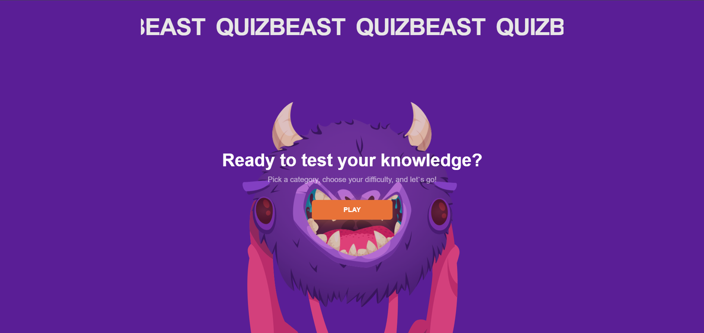

# QuizBeast

Interactive quiz application built with React. Choose a category, pick a difficulty level, answer questions, and see your results — all wrapped in a polished animated UI with a charming couscous mascot.

## Preview

<!-- Replace the path below with your screenshot -->



## Tech Stack

- **React 18** + **TypeScript** — UI and type safety
- **Vite** — build tool and dev server
- **Zustand** + **Immer** — state management with immutable updates
- **MUI v5** + **Emotion** — component library and styling
- **Framer Motion** — page transitions and UI animations
- **React Router DOM v6** — client-side routing
- **Axios** — HTTP client for the quiz API
- **ESLint** + **Prettier** — code quality and formatting

## Architecture

The project follows **Feature-Sliced Design (FSD)** methodology:

```
src/
├── app/                    # Application layer
│   ├── providers/          # Router, Theme
│   └── store/              # Zustand slices (game, answers, category)
├── entities/               # Business entities
│   ├── Category/           # Category API and types
│   └── Question/           # Question API, types, and helpers
├── pages/                  # Page components
│   ├── Home/               # Landing page
│   ├── Category/           # Category selection
│   ├── Difficulty/         # Difficulty selection
│   ├── Game/               # Quiz gameplay
│   ├── Result/             # Results breakdown
│   └── 404/                # Not found page
└── shared/                 # Shared utilities
    ├── lib/                # Axios config, router paths, helpers
    └── ui/                 # Reusable UI (mascot SVG, parallax text)
```

## User Flow

```
Home → Category → Difficulty → Game → Results
                                        ↓
                               Play again / Home
```

## Getting Started

### Prerequisites

- **Node.js** 18+
- **Yarn** 1.x

### API Key

The app uses [QuizAPI](https://quizapi.io/) to fetch questions. Get a free API key at [quizapi.io](https://quizapi.io/).

### Installation

```bash
git clone <repository-url>
cd QuizBeast
yarn install
```

### Environment Variables

Copy the example env file and add your API key:

```bash
cp .env.example .env
```

| Variable            | Description      | Example                     |
| ------------------- | ---------------- | --------------------------- |
| `VITE_API_BASE_URL` | QuizAPI base URL | `https://quizapi.io/api/v1` |
| `VITE_API_KEY`      | Your QuizAPI key | `abc123...`                 |

### Development

```bash
yarn dev
```

The app will be available at [http://localhost:3000](http://localhost:3000).

### Build

```bash
yarn build
```

### Lint

```bash
yarn lint
```

### Preview Production Build

```bash
yarn preview
```
